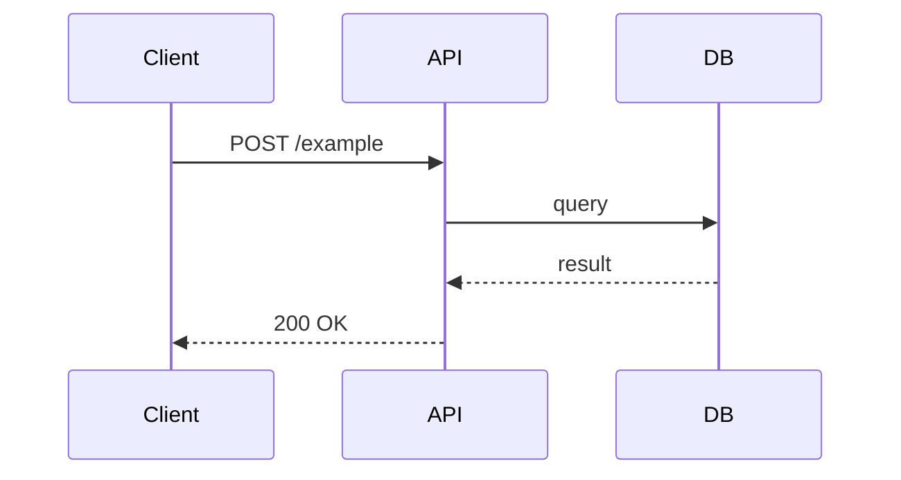

# Design: [Spec Name]

## Overview

[One paragraph summarizing the approach. What are the key decisions? What constraints shaped this design?]

## Architecture

[Describe the components involved and their responsibilities. A simple diagram helps if there are multiple moving parts.]

```
┌────────┐  ┌─────┐  ┌──────────┐
│ Client │─▶│ API │─▶│ Database │
└────────┘  └─────┘  └──────────┘
```

## Data Models

```
[ModelName]
├── id: uuid
├── field_one: string
├── field_two: datetime
└── ...
```

[Describe any important constraints, indexes, or relationships.]

## Key Interfaces / API Contracts

### `POST /example`

**Request:**
```json
{
  "field": "value"
}
```

**Response (200):**
```json
{
  "id": "uuid",
  "result": "value"
}
```

**Errors:**
- `400` — validation failure
- `401` — unauthenticated
- `409` — conflict (e.g., duplicate)

## Key Flows



[Describe the flow in prose if the diagram alone isn't enough.]

## Error Handling

| Scenario | Behavior |
|----------|----------|
| Invalid input | Return 400 with field-level errors |
| External service unavailable | Return 503, surface user-friendly message |
| Unexpected exception | Log full stack trace, return 500 |

## Testing Strategy

- **Unit tests:** [What logic is unit-testable in isolation? e.g., validation rules, model methods]
- **Integration tests:** [What requires a real DB or service? e.g., auth flow end-to-end]
- **Edge cases to cover:** [List non-obvious cases worth a dedicated test]
